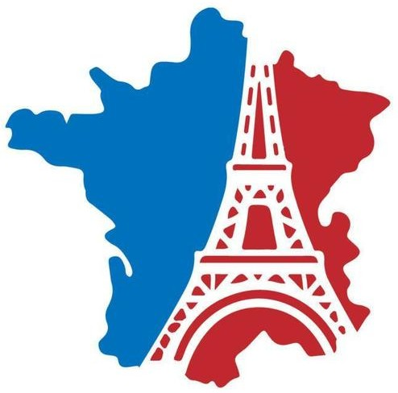

### Hi there 👋
My name is Ming, you can call me Eric. I am currently studying Machine Learning and lots of others things in Montreal in order to eventually become a Machine Learning Engineer. There will be much more bitter lesson from the journey into Machine Learning. 
 
 

### My projects:
I am planning to acquire skills and experience in Machine Learning via Hands-On Projects, work-study or internships in order to make it my job.
 
 

### My interests:
- ML, LLM, GenAI
- Music
- Film
- Travel and Camping
- Learning Languages.
 

### Tools, Languages and Frameworks I use:
-   
-   
<!--  -->
 

### The languages I speak:
-  **Mandarin**, it is my native language.
-  **English**, the second language I use the most throughout my day.
-  **French**, continue to improve it, I also use it in daily living.
-  I am learning **Japanese** with duolingo.
 
  

Feel free to check my Github, I am going to do more programming works, then upload on Github.
Welcome to give me some advice in order to master Machine Learning quickly.
 
 

 

